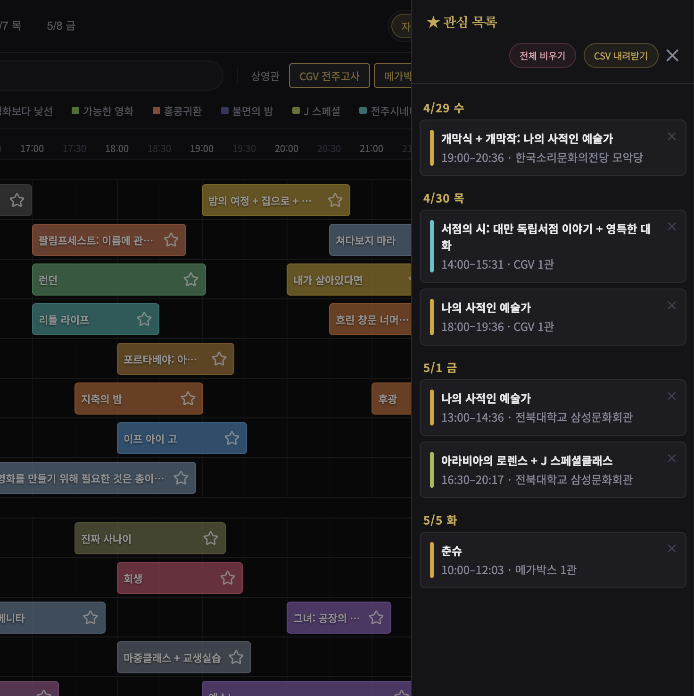

# JIFF 2026 상영시간표

전주국제영화제 2026 상영작을 날짜와 극장 기준으로 빠르게 훑어보고, 관심작을 모아보는 시간표 웹앱입니다.

## 한눈에 보기

- 날짜별 상영 일정을 타임라인으로 확인
- 상영관 그룹, 섹션, 검색어로 빠르게 필터링
- 관심작 저장, 전체 비우기, CSV 내려받기 지원
- 상세 페이지는 새 탭으로 열기
- 보고 있던 날짜는 URL에 반영되어 새로고침 후에도 유지

## 실행 방법

별도 설치 없이 루트의 `index.html`을 브라우저에서 열면 됩니다.

## 주요 파일

- `index.html`: 앱 진입 파일
- `jiff2026/app.js`: 상태, 렌더링, 이벤트 처리
- `jiff2026/config.js`: 날짜, 보기 밀도, 색상 등 설정
- `jiff2026/data.js`: 상영 데이터 원본
- `jiff2026/directors.js`: 감독명 및 상세 링크 메타데이터
- `scripts/sync-jiff-directors.js`: 상세 링크/감독 정보 동기화 스크립트

## 이런 때 유용합니다

- 날짜별로 무엇을 볼지 빠르게 훑고 싶을 때
- GV 여부나 섹션 기준으로 동선을 짜고 싶을 때
- 관심작만 따로 모아서 저장하거나 내려받고 싶을 때
